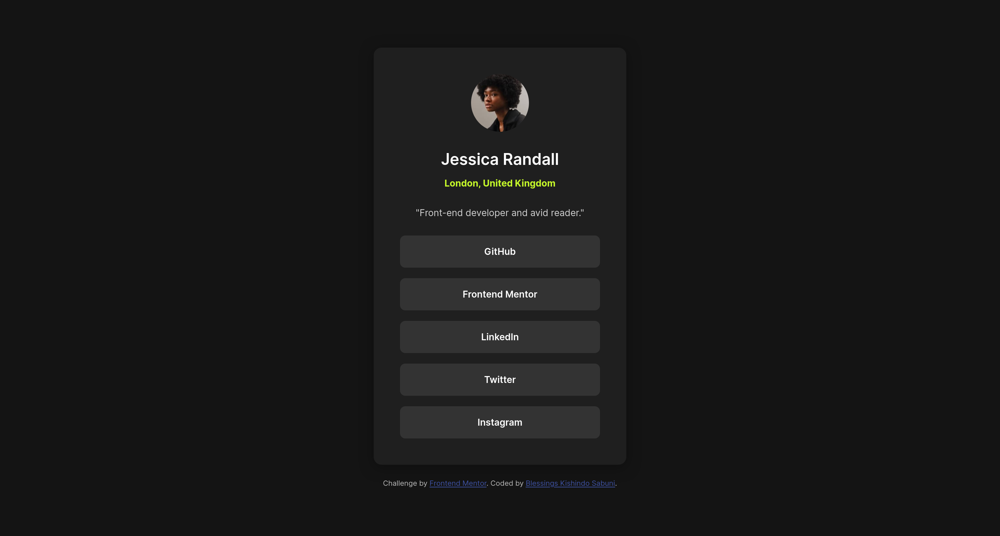
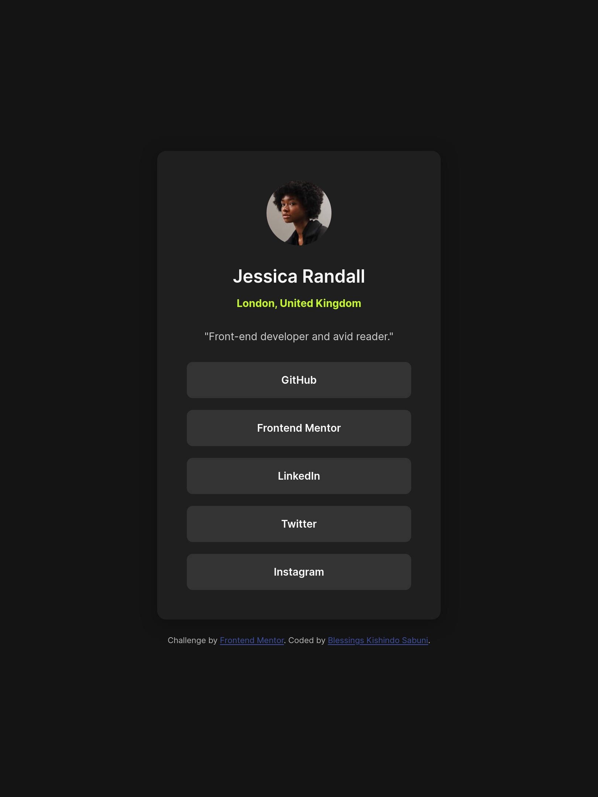
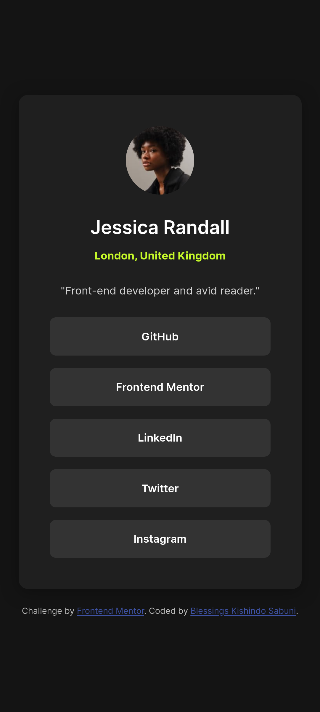

# Frontend Mentor - Social links profile solution

This is a solution to the [Social links profile challenge on Frontend Mentor](https://www.frontendmentor.io/challenges/social-links-profile-UG32l9m6dQ). Frontend Mentor challenges help you improve your coding skills by building realistic projects. 

## Table of contents

- [Overview](#overview)
  - [The challenge](#the-challenge)
  - [Screenshot](#screenshot)
  - [Links](#links)
- [My process](#my-process)
  - [Built with](#built-with)
  - [What I learned](#what-i-learned)
  - [Continued development](#continued-development)
  - [Useful resources](#useful-resources)
- [Author](#author)
- [Acknowledgments](#acknowledgments)

## Overview

### The challenge

Users should be able to:

- View the optimal layout for the interface depending on their device's screen size.
- See hover and focus states for all interactive elements on the page
- Access all interactive elements using keyboard navigation.
- Have a screen reader-friendly experience with proper semantic structure.

### Screenshot

Desktop 

Tablet 

Mobile 

### Links

- Solution URL: [Social links profile codebase](https://github.com/sparechange679/social-links-profile.git)
- Live Site URL: [Social links profile](https://sparechange679.github.io/social-links-profile/)

## My process

### Built with

- Semantic HTML5 markup
- CSS custom properties
- Flexbox
- Mobile-first workflow
- Accessibility-first approach
- Local font loading for privacy
- [Google Web Fonts Helper](https://gwfh.mranftl.com/fonts/inter?subsets=latin) - Inter 400, 600, 700

### What I learned

This project reinforced my understanding of creating accessible web components with proper semantic structure and keyboard navigation. I focused on implementing WCAG guidelines while maintaining a clean, modern design.

One key accessibility feature I implemented was proper ARIA attributes and focus management:

```html
<nav aria-labelledby="profile-bio">
  <ul class="social-links" role="list">
    <li class="social-link" role="listitem">
      <a href="#" aria-label="Visit Jessica's GitHub profile">GitHub</a>
    </li>
  </ul>
</nav>
```

I also learned how to create smooth hover and focus states that maintain accessibility:

```css
.social-link a:focus {
  outline: 2px solid var(--green);
  outline-offset: 2px;
}

.social-link a:hover,
.social-link a:focus {
  background-color: var(--green);
  color: var(--grey-900);
}
```

Another important aspect was implementing reduced motion support for users with vestibular disorders:

```css
@media (prefers-reduced-motion: reduce) {
  .social-link a {
    transition: none;
  }
}
```

### Continued development

In future projects, I want to focus on:

- Implementing more complex CSS Grid layouts for larger components

- Exploring CSS container queries for more flexible responsive designs

- Improving my skills in accessibility testing with screen readers

- Experimenting with CSS custom properties for theming and dark/light mode switching

### Useful resources

- [MDN Web Docs - ARIA](https://developer.mozilla.org/en-US/docs/Web/Accessibility/ARIA) -  Excellent resource for understanding ARIA attributes and their proper usage.

- [WebAIM Color Contrast Checker](https://webaim.org/resources/contrastchecker/) - Helped ensure all color combinations met WCAG standards.
- [A11Y Project](https://www.a11yproject.com/) - Great collection of accessibility patterns and best practices.
- [Frontend Mentor Community](https://www.frontendmentor.io) - Valuable feedback and inspiration from other developers.

## Author

- Github - [Blessings](https://github.com/sparechange679)
- Frontend Mentor - [@sparechange679](https://www.frontendmentor.io/profile/sparechange679)

## Acknowledgments

I'd like to thank the Frontend Mentor community for providing constructive feedback and the design team for creating such clean, accessible design specifications. The challenge helped me deepen my understanding of accessibility implementation in real-world projects.

Special thanks to the Web Content Accessibility Guidelines (WCAG) community for providing clear standards that make the web more inclusive for everyone.
